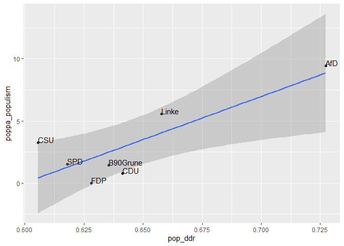

<!-- README.md is generated from README.Rmd. Please edit that file -->

# dictvectoR 

<!-- badges: start -->

[](https://zenodo.org/badge/latestdoi/438666102)
[](https://github.com/thieled/dictvectoR/actions/workflows/R-CMD-check.yaml)
<!-- badges: end -->

dictvectoR implements the “Distributed Dictionary Representation” (DDR)
Method (Garten et al., 2018).

The DDR uses a word vector representation of a dictionary, i.e. a list
of words that reflect a theoretical concept, to calculate “a continuous
measure of similarity between that concept and any other piece of text”
\[1\].

Word vectors, also called word embeddings, aim to represent semantic
proximity of words in a vector space \[2\].

This package uses fastText word vectors \[3\]. Average vector
representations are computed for the concept dictionary and each
document. The DDR score then is the cosine similarity between those
vectors \[1\].

In addition to this core function, the package comes with a range of
functions that help to find keywords and to assess the performance of
these words and dictionaries. You can learn about the workflow of
training a fastText model, finding a good dictionary, and evaluating its
performance in `vignette("from_text_to_measurement")`. The workflow is
described in greater detail in \[4\].

To demonstrate its usage, the package comes with a corpus of 20,838
Tweets from 32 Twitter accounts from German politics, published between
2020-03-11 and 2021-09-25, and a hand-coded sample of 1,000 Tweets from
this corpus, coded along two binary variables for populist
communication: Anti-elitism and people-centrism.

The package also includes a minimal fastText model, which only serves to
provide working examples for the functions of this package and is NOT
recommended to be used in any actual analysis.

## Installation

You can install the development version of dictvectoR from
[GitHub](https://github.com/) with:

``` r
# install.packages("devtools")
devtools::install_github("thieled/dictvectoR")
```

## Example

This is a basic example, starting from scratch, using the built-in
Twitter data from German politicians during the Covid-crisis.

To get started, we need a fastText word vector model, which we will
train on the pre-processed data, which is cleaned, split, and shuffled
by `[prepare_train_data]`. For demonstration purposes, we keep the model
simple and small.

For an actual application, you might want to consider using much more
textual data, more epochs, more dimensions and a larger bucket size. You
might also consider using a (not task-specific) pre-trained model from
[here](https://github.com/facebookresearch/fastText/blob/master/docs/crawl-vectors.md).

(Note: The code below will create a fastText model in the user home
directory which will be deleted again at the end of this readme.)

``` r
library(dictvectoR)
library(dplyr)

# Prepare text data. Cleans, splits, and shuffles textual data
texts <- prepare_train_data(tw_data, text_field = "full_text", seed = 42)

# Create local folder, set model file name
dir.create("~/ft_model_readme", showWarnings = FALSE)
model_file <- path.expand("~/ft_model_readme/ft_model_demo")

# Train a fasttext model using the twitter data
fastrtext::build_vectors(texts, 
                         model_file, 
                         modeltype = c("skipgram"),
                         dim = 70, epoch = 5, bucket = 5e+4, lr = 0.1,
                         maxn = 6,  minn = 4, minCount = 4,
                         verbose = 1, ws= 5)

# Load model:
model_path <- path.expand("~/ft_model_readme/ft_model_demo.bin")
model <- fastrtext::load_model(paste0(model_path))
```

The text data loaded here are Tweets from German politicians, posted
between the beginning of the Covid pandemic and the German General
Elections in September 2021. First, we clean the textual data, using the
helper function `[clean_text]`, which is tailored to German social media
texts.

``` r
tw_data %<>% clean_text(text_field = "full_text", remove_stopwords = T)
```

Now, lets apply the DDR method. Let’s say we want to measure the degree
of populism in each of these Tweets.

We first define an ad-hoc short dictionary that we consider to reflect
important dimensions of populist communication and apply the DDR method
using this short dictionary by `[cossim2dict]`.

``` r
# Define a short dictionary
pop_dict <- c("merkel",
              "irrsinn",
              "diktatur",
              "lobbyismus",
              "arbeitende menschen",
              "deutschland",
              "unsere steuergelder")

# Get the DDR score
tw_data$pop_ddr <- cossim2dict(tw_data, pop_dict, model, replace_na = 'mean-sd')
```

Let’s have a look at the top 3 populist Tweets, according to our ad-hoc
measurement:

``` r
tw_data %>%
  dplyr::arrange(desc(pop_ddr)) %>%
  head(3) %>%
  dplyr::pull(full_text)
#> [1] "Ein Finanzminister #Scholz, der sein Land verkauft, hat im Kanzleramt nichts verloren. Nach #Merkel muss der Neuanfang folgen und zu dem gehört zuvörderst eine Finanzpolitik im Sinne 🇩🇪, ohne Schuldenunion und schwarzes Transferloch Richtung Brüssel! #AfD https://t.co/JWY4QwgPAS https://t.co/h58SWQcv0b"
#> [2] "Korruption, Vetternwirtschaft, Geldgier, Amtsmissbrauch. Bei #Chebli, ihrem Mann Nizar Maarouf und deren “Clan“ ist alles dabei. Geld verdienen zulasten von Berlins Kranken. Man muss diesen schwarzen und rotrotgrünen Sumpf dringend trockenlegen. #Vivantes https://t.co/zKLd0HrVVE"                        
#> [3] "Merkel macht Rechtsbruch zum politischen Prinzip! Die #GroKo glänzt durch Totalversagen. Von Wirtschaft über Klima und Justiz bis hin zu Flüchtlingspolitik und #Corona-Wahn – alles haben #Merkel und ihre Regierung in den Sand gesetzt. Meine Generalabrechnung seht Ihr im Video: https://t.co/CKTKcvgd4W"
```

If you speak some German, you can judge from face-validity that these
top results appear quite plausible.

Let’s have a quick look if this measurement can re-create scores from
the POPPA expert survey, which rated parties along a contiuous score for
populism. This score is already included in `tw_data`:

``` r
# aggregate
tw_party <- tw_data %>% 
              group_by(party) %>%
              summarise(pop_ddr = mean(pop_ddr),
                        poppa_populism = mean(poppa_populism)) 

# plot
library(ggplot2)
ggplot(tw_party, aes(x = pop_ddr, y = poppa_populism, label=party))+
  geom_point(na.rm = T)+
  geom_smooth(method = lm)+
  geom_text(hjust=0, vjust=0)
```



On this aggregate level, the expert survey rating and our ad-hoc DDR
measurement are highly correlated:

``` r
cor(tw_party$pop_ddr, tw_party$poppa_populism)
#> [1] 0.8376652
```

## Finding keywords

dictvectoR provides a variety of functions to inductively find good
keywords and to efficiently assess the performance of many of them. You
can learn about the complete workflow in
`vignette("from_text_to_measurement")`.

Have fun!

(But first, let’s delete the demo model:)

``` r
unlink("~/ft_model_readme", recursive = TRUE)
```

## References

\[1\] Garten, J., Hoover, J., Johnson, K. M., Boghrati, R., Iskiwitch,
C., & Dehghani, M. (2018). Dictionaries and distributions: Combining
expert knowledge and large scale textual data content analysis. Behavior
Research Methods, 50(1), 344–361.
<https://doi.org/10.3758/s13428-017-0875-9>

\[2\] Mikolov, T., Chen, K., Corrado, G., & Dean, J. (2013). Efficient
Estimation of Word Representations in Vector Space. ArXiv:1301.3781
\[Cs\]. <http://arxiv.org/abs/1301.3781>

\[3\] Bojanowski, P., Grave, E., Joulin, A., & Mikolov, T. (2017).
Enriching Word Vectors with Subword Information. ArXiv:1607.04606
\[Cs\]. Retrieved from <http://arxiv.org/abs/1607.04606>

\[4\] Thiele, D. (2022, June 27). “Don’t believe the media’s pandemic
propaganda!!” How Covid-19 affected populist Facebook user comments in
seven European countries. Presented at the ICA Regional Conference 2022.
Computational Communication Research in Central and Eastern Europe,
Helsinki, Finland. Retrieved from
<https://ucloud.univie.ac.at/index.php/s/PzGzChXroLCXrtt>

\[5\] Meijers, M., & Zaslove, A. (2020). Populism and Political Parties
Expert Survey 2018 (POPPA) \[Data set\]. Harvard Dataverse.
<https://doi.org/10.7910/DVN/8NEL7B>
